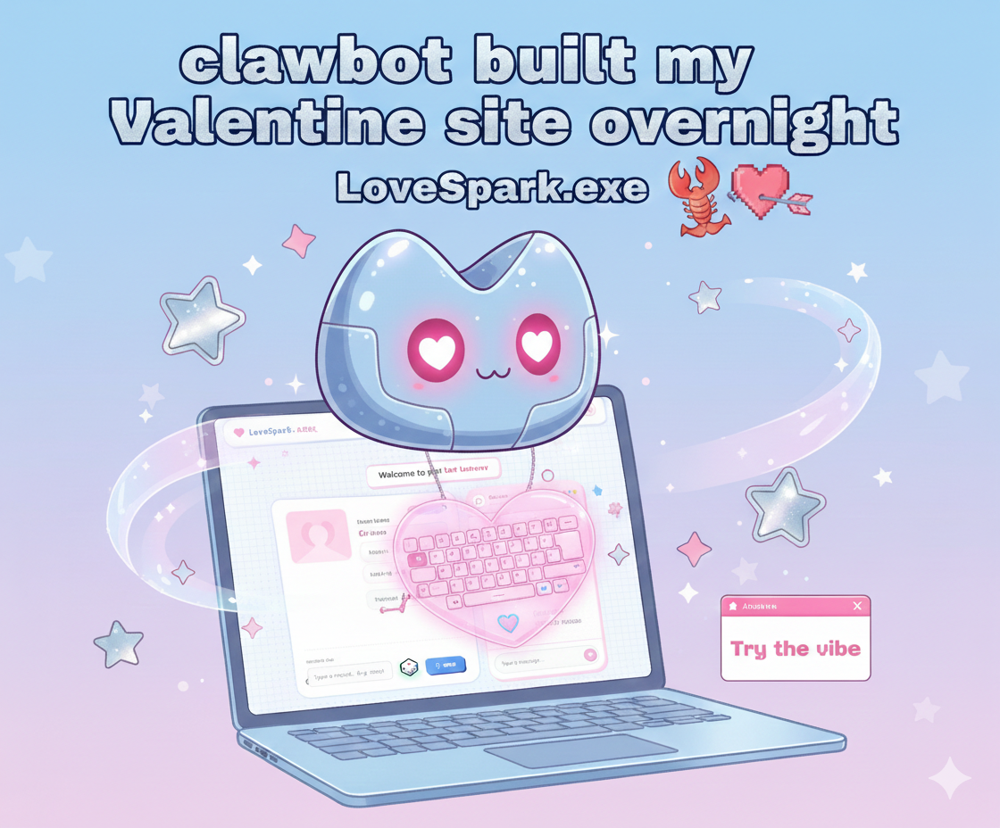
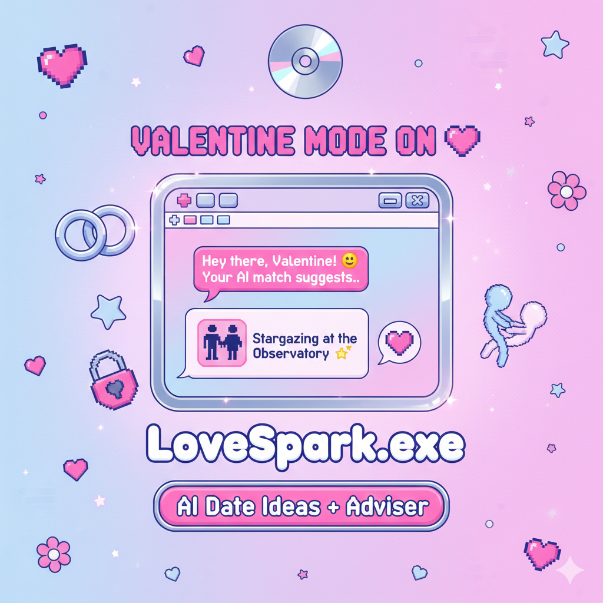
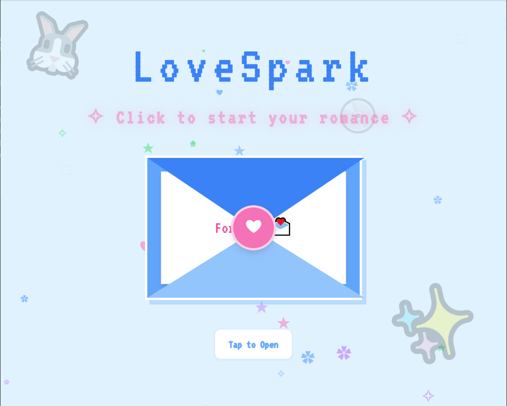
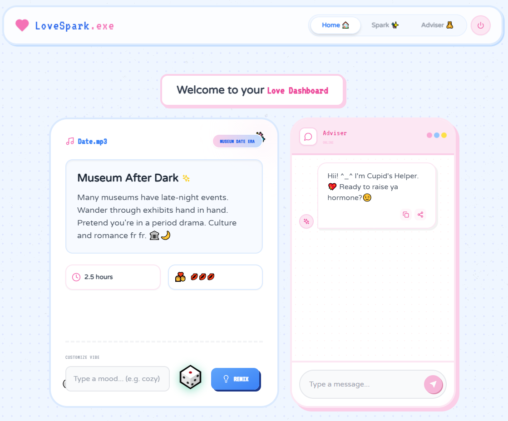
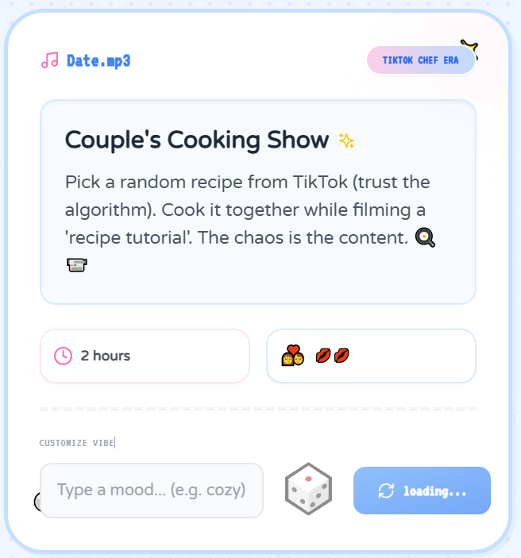
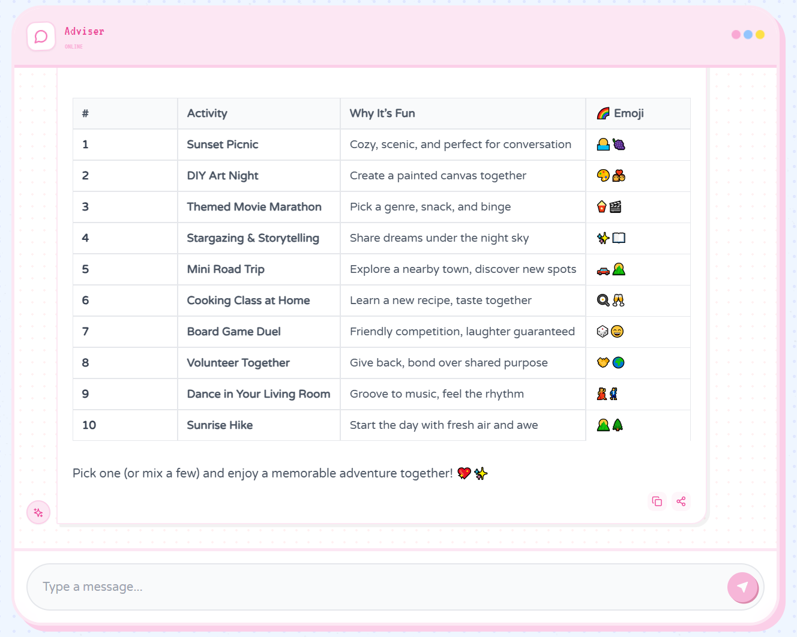

# LoveSpark ✨

<!-- <div align="center">

</div> -->

## 🔥 Valentine Campaign Highlights

| Clawbot Campaign | Valentine Campaign |
|---|---|
|  |  |

### English Intro

- Built overnight for Valentine panic mode: LoveSpark turns "idk what to do" into playful, usable date plans.
- From spark ideas to adviser chat, this Y2K AI copilot helps couples plan faster and flirt smarter.

### 中文 Intro

- 为“情人节临时救场”连夜做的 LoveSpark：把“今天约会干嘛”变成可直接执行的方案。
- 从约会灵感到恋爱顾问聊天，这个 Y2K 风 AI 工具让情侣更快出计划、更自然升温。

### Slogan
- EN: Try the vibe. Remix ideas. Keep the spark alive.
- CN: 先试氛围，再一键重抽，让约会不再尬住。

## 📖 Project Overview / 项目概述

### English
LoveSpark is a Y2K aesthetic dating advisor web application that helps couples create romantic date experiences. Built with React, TypeScript, and integrated with AI services (SiliconFlow/OpenAI-compatible API), it generates personalized date ideas and provides a cute chatbot companion for relationship advice.

### 中文
LoveSpark 是一款 Y2K 风格的恋爱约会助手网页应用，帮助情侣创造浪漫的约会体验。基于 React 和 TypeScript 构建，集成 AI 服务（SiliconFlow/OpenAI 兼容 API），生成个性化约会建议，并提供可爱的聊天机器人伴侣进行情感咨询。

---

## ✨ Features / 功能特点

| English | 中文 |
|---------|------|
| Y2K aesthetic UI with playful animations | Y2K 风格 UI，配有趣味动画 |
| AI-powered date idea generator | AI 驱动的约会灵感生成器 |
| Interactive chatbot for relationship advice | 互动聊天机器人提供恋爱建议 |
| Romantic Spotify music player | 浪漫 Spotify 音乐播放器 |
| Responsive design for mobile & desktop | 响应式设计，适配移动端和桌面端 |

---

## 📸 Product Screenshots

<p align="center">
  
</p>

<p align="center">
  
</p>

| Spark Date Idea | Adviser Chat |
|---|---|
|  |  |

<p align="center">
  
</p>

---

## 🚀 Quick Start / 快速开始

### Prerequisites / 前置要求

- Node.js 18+ 
- npm or yarn
- SiliconFlow API Key (get it from [siliconflow.com](https://www.siliconflow.com))

### Installation / 安装

```bash
# 1. Clone the repository / 克隆仓库
git clone https://github.com/your-username/date_advise.git
cd date_advise

# 2. Install dependencies / 安装依赖
npm install

# 3. Configure environment variables / 配置环境变量
# Copy the example env file / 复制环境变量示例文件
cp .env.local.example .env.local

# 4. Add your API key / 添加 API 密钥
# Edit .env.local and set:
# 编辑 .env.local 并设置:
VITE_SILICONFLOW_API_KEY=your_api_key_here

# 5. Start the development server / 启动开发服务器
npm run dev
```

### Environment Variables / 环境变量

Create a `.env.local` file in the project root with the following variables:

在项目根目录创建 `.env.local` 文件，包含以下变量：

```env
# SiliconFlow API Key (Required / 必填)
VITE_SILICONFLOW_API_KEY=your_siliconflow_api_key

# Optional / 可选
VITE_APP_TITLE=LoveSpark
```

---

## 📁 Project Structure / 项目结构

```
date_advise/
├── src/
│   └── vite-env.d.ts      # TypeScript definitions
├── components/
│   ├── Envelope.tsx       # Opening envelope animation
│   ├── ChatBot.tsx        # AI chat interface
│   └── DateIdeaCard.tsx   # Date idea display card
├── services/
│   └── siliconflowService.ts  # AI API integration
├── constants.ts           # App constants
├── types.ts               # TypeScript types
├── App.tsx                # Main app component
├── index.html             # HTML entry
└── package.json           # Dependencies
```

---

## 🛠️ Tech Stack / 技术栈

| Category | Technology |
|----------|------------|
| Frontend Framework | React 18 |
| Language | TypeScript |
| Styling | Tailwind CSS |
| Animations | Framer Motion |
| Icons | Lucide React |
| AI Service | SiliconFlow (OpenAI-compatible) |
| Build Tool | Vite |

---

## 🎨 Design Philosophy / 设计理念

### English
The app follows a "NewJeans-core" aesthetic - ethereal, nostalgic, and airy. Key design elements include:
- Soft pastel color palette (pink, blue, lavender)
- Playful animations and micro-interactions
- Pixel/retro digital elements
- Warm and inviting atmosphere

### 中文
应用遵循 "NewJeans 核心" 美学风格——空灵、怀旧、清新。关键设计元素包括：
- 柔和的粉彩配色（粉色、蓝色、薰衣草紫）
- 趣味动画和微交互
- 像素/复古数字元素
- 温暖邀请的氛围

---

## 📝 API Configuration / API 配置

### Supported Models / 支持的模型

The app currently uses SiliconFlow's OpenAI-compatible API with models like:

应用目前使用 SiliconFlow 的 OpenAI 兼容 API，支持以下模型：

- `deepseek-ai/DeepSeek-V2.5`
- `openai/gpt-4o`
- `openai/gpt-oss-20b`

### Getting an API Key / 获取 API 密钥

1. Visit [SiliconFlow](https://www.siliconflow.com)
2. Create an account / 创建账户
3. Navigate to API section / 前往 API 页面
4. Generate your API key / 生成 API 密钥

---

## 🤝 Contributing / 贡献

Contributions are welcome! Please feel free to submit a Pull Request.

欢迎贡献！请随时提交 Pull Request。

---

## 📄 License / 许可证

Apache License Version 2.0, January 2004
<http://www.apache.org/licenses/>
---

## 👨‍💻 Author / 作者

Made with 💖 by Leo🌊 in 2026b efore Valentine 💓 

---

# Brief Project Introduction / 简短项目介绍

## English
LoveSpark is a Y2K-styled dating advisor web app that generates personalized romantic date ideas using AI. Features include a cute opening envelope animation, AI-powered date suggestions , an interactive chatbot for relationship advice, and a romantic Spotify music player. Built with React, TypeScript, and Tailwind CSS.

## 中文
LoveSpark 是一款 Y2K 风格的恋爱约会助手网页应用，使用 AI 生成个性化浪漫约会灵感。特色功能包括可爱的信封开场动画、AI 驱动的约会建议、互动聊天机器人提供恋爱咨询，以及浪漫的 Spotify 音乐播放器。基于 React、TypeScript 和 Tailwind CSS 构建。
